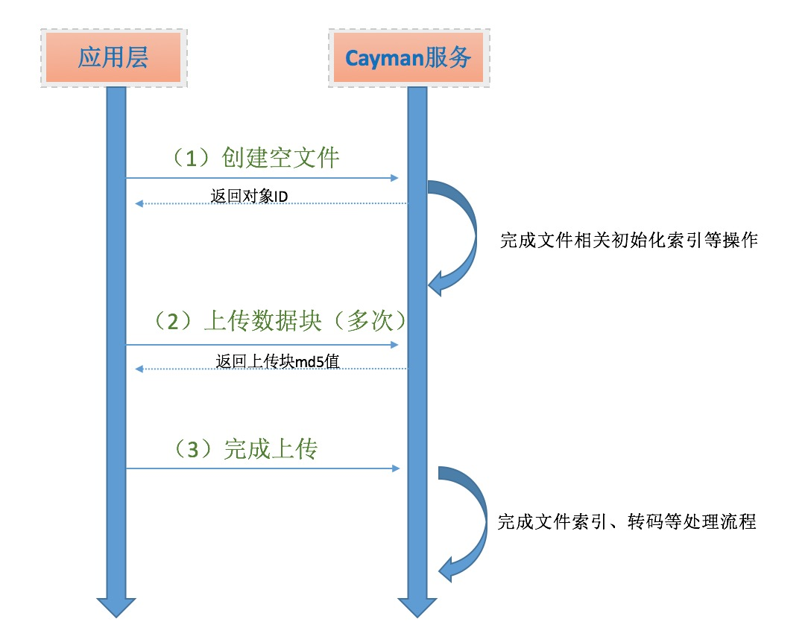

# 对象管理
---------

文件上传数据块限制大小为4M，超出 4M的文件应该采用分块上传	机制（每次上传小于4M，下图是文件上传的一般流程：

(1) 创建文件 --/api/cayman/store/object/create
(2) 上传数据块 --/api/cayman/store/object/write
注： 大于4M的文件重复 （2）的步骤，上传时指定 offset, len
(3) 上传完成后调用 finish 接口，通知服务器上传完成 --/api/v2/core/object/finish完成上传操作
(5)对于上传完成的文件编辑和数据读取可直接调用/api/cayman/store/object/write /api/cayman/store/object/read 进行编辑修改或读取，无需其他操作。 
